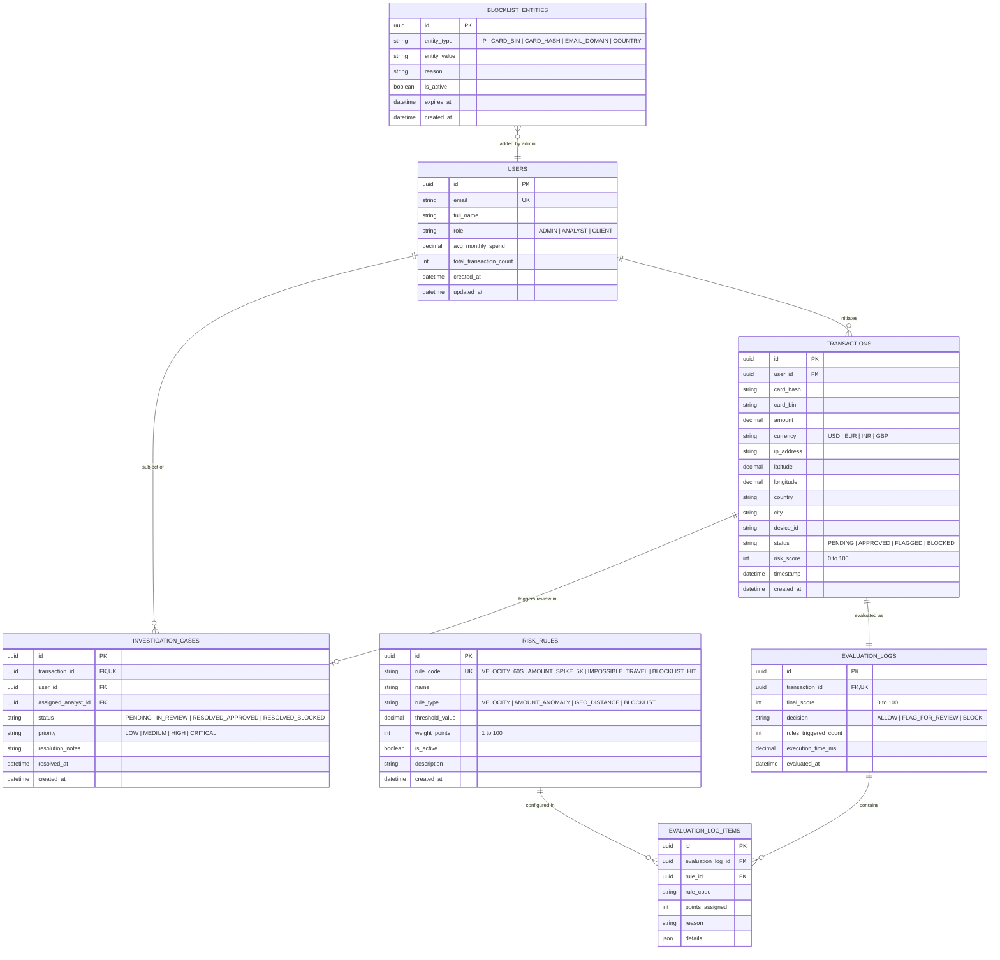

# 🛡️ SentriQ — API Design & Entity Relationship Specification

## 1. Domain Entities & Relationships



---

## 2. API Contract Specification

### Base URL: `/api/v1`

---

### Endpoint 1: Real-Time Transaction Ingestion & Evaluation
* **Path:** `POST /api/v1/transactions/evaluate`
* **Description:** Evaluates an incoming transaction against active fraud rules and returns an immediate decision (`ALLOW`, `FLAG_FOR_REVIEW`, `BLOCK`).

#### Request Contract:
```json
{
  "user_id": "3fa85f64-5717-4562-b3fc-2c963f66afa6",
  "card_hash": "a1b2c3d4e5f67890abcdef1234567890abcdef12",
  "card_bin": "411111",
  "amount": 2500.00,
  "currency": "USD",
  "ip_address": "198.51.100.42",
  "location": {
    "latitude": 40.7128,
    "longitude": -74.0060,
    "country": "US",
    "city": "New York"
  },
  "device_id": "dev_xyz_98765",
  "timestamp": "2026-09-02T10:00:00Z"
}
```

#### Success Response (`200 OK`):
```json
{
  "transaction_id": "9b1deb4d-3b7d-4bad-9bdd-2b0d7b3dcb6d",
  "user_id": "3fa85f64-5717-4562-b3fc-2c963f66afa6",
  "risk_score": 85,
  "decision": "BLOCK",
  "rules_triggered": [
    {
      "rule_code": "AMOUNT_SPIKE_5X",
      "rule_name": "Amount Spike Anomaly",
      "points": 50,
      "reason": "Transaction amount $2500.00 exceeds 5x user average ($350.00)"
    },
    {
      "rule_code": "IMPOSSIBLE_TRAVEL",
      "rule_name": "Impossible Geo-Velocity",
      "points": 35,
      "reason": "Distance from previous transaction is 5,585 km within 12 minutes (Speed: 27,925 km/h)"
    }
  ],
  "execution_time_ms": 8.45,
  "evaluated_at": "2026-09-02T10:00:00.125Z"
}
```

#### Error Responses:
* `422 Unprocessable Entity` — Invalid schema payload (e.g., negative amount, invalid IP format, unsupported currency).
* `400 Bad Request` — Missing required transaction fields.
* `500 Internal Server Error` — Engine processing error.

---

### Endpoint 2: List Pending Fraud Investigation Cases
* **Path:** `GET /api/v1/cases/pending`
* **Query Parameters:** `page` (default 1), `size` (default 20), `priority` (optional filter)
* **Success Response (`200 OK`):**
```json
{
  "total": 1,
  "page": 1,
  "size": 20,
  "items": [
    {
      "case_id": "c1a2b3c4-d5e6-7f8a-9b0c-1d2e3f4a5b6c",
      "transaction_id": "9b1deb4d-3b7d-4bad-9bdd-2b0d7b3dcb6d",
      "user_id": "3fa85f64-5717-4562-b3fc-2c963f66afa6",
      "amount": 1200.00,
      "currency": "USD",
      "risk_score": 55,
      "priority": "HIGH",
      "status": "PENDING",
      "created_at": "2026-09-02T09:45:00Z"
    }
  ]
}
```

---

### Endpoint 3: Resolve Fraud Investigation Case
* **Path:** `POST /api/v1/cases/{case_id}/resolve`
* **Request Contract:**
```json
{
  "action": "APPROVE",
  "resolution_notes": "Customer confirmed legitimate transaction via phone verification."
}
```
* **Success Response (`200 OK`):**
```json
{
  "case_id": "c1a2b3c4-d5e6-7f8a-9b0c-1d2e3f4a5b6c",
  "status": "RESOLVED_APPROVED",
  "analyst_id": "e8f7a6b5-c4d3-2e1f-0a9b-8c7d6e5f4a3b",
  "resolution_notes": "Customer confirmed legitimate transaction via phone verification.",
  "resolved_at": "2026-09-02T10:15:30Z"
}
```
* **Error Response (`404 Not Found`):** Case ID does not exist.

---

### Endpoint 4: Manage Risk Rules (Admin)
* **Path:** `GET /api/v1/rules` — List all rules.
* **Path:** `POST /api/v1/rules` — Create a new rule.
* **Path:** `PATCH /api/v1/rules/{rule_id}` — Update threshold or point weights.

---

### Endpoint 5: Manage Blocklist & Allowlist
* **Path:** `GET /api/v1/blocklist` — List blocked entities.
* **Path:** `POST /api/v1/blocklist` — Add an entity (IP, BIN, Email domain).
* **Path:** `DELETE /api/v1/blocklist/{id}` — Unblock entity.

---

### Endpoint 6: Fraud Analytics & Metrics
* **Path:** `GET /api/v1/analytics/overview`
* **Success Response (`200 OK`):**
```json
{
  "total_transactions_evaluated": 12450,
  "total_amount_evaluated": 3450000.00,
  "total_fraud_blocked_amount": 182500.00,
  "decisions_breakdown": {
    "ALLOW": 11800,
    "FLAG_FOR_REVIEW": 450,
    "BLOCK": 200
  },
  "top_triggered_rules": [
    { "rule_code": "VELOCITY_60S", "count": 185 },
    { "rule_code": "AMOUNT_SPIKE_5X", "count": 142 },
    { "rule_code": "IMPOSSIBLE_TRAVEL", "count": 93 }
  ]
}
```
